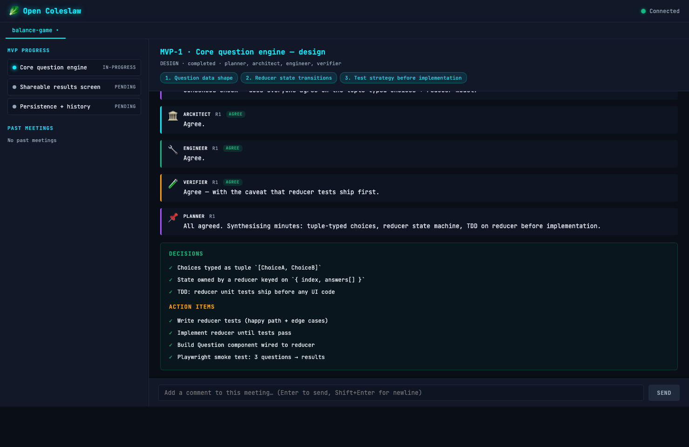

# 🥬 Open Coleslaw

[](https://www.npmjs.com/package/open-coleslaw)
[](LICENSE)
[](package.json)
[](https://www.npmjs.com/package/open-coleslaw)

> **Type a prompt. Get a real multi-agent engineering team. No commands to learn.**

Open Coleslaw is a multi-agent orchestrator plugin for [Claude Code](https://claude.com/claude-code). Every prompt runs through a **kickoff meeting → per-MVP design meeting → plan mode → parallel workers → verification** pipeline — with each speaker turn being a real `Agent` dispatch, not role-play.



---

## Quick Start

In Claude Code:

```
/plugin marketplace add sshworld/open-coleslaw
/plugin install open-coleslaw@sshworld
```

Open a new session, then just type what you want:

```
Build me a balance-game web app
```

That's it. Watch the meeting unfold at **http://localhost:35143**.

---

## What You Type vs What Happens

| You type | The pipeline runs |
|---|---|
| `Build me a balance-game web app` | Kickoff → 3 MVPs → per-MVP design meeting → plan mode → workers → verified |
| `Fix the flaky login test` | Kickoff (1 MVP) → design meeting w/ engineer + verifier → plan → fix → green |
| `Should we migrate from Redux to Zustand?` | Design meeting w/ architect + engineer + researcher → minutes with recommendation |

You don't call a tool. You don't pick a department. You don't write prompt templates.
The main Claude session **dispatches each specialist as a real subagent** and
collects their actual output into the meeting transcript.

---

## Why Open Coleslaw

- **Real multi-agent, not one-LLM role-play.** Every speaker turn is a separate `Agent` dispatch with its own context. The dashboard shows the real comments as they stream in.
- **Consensus, not round count.** A meeting only ends when everyone actually agrees. If 10 rounds pass without consensus, you get an `@mention` to break the tie.
- **Minutes survive compaction.** Everything is written to `docs/open-coleslaw/` inside your project. `/compact` and `/clear` don't lose meeting history.
- **Model-agnostic.** No hardcoded model names anywhere. Switch with `/model` and the whole pipeline follows — Opus, Sonnet, Haiku, or whatever ships next.

---

## The Team

7 agents, all dispatched by the main Claude session:

| Agent | Role |
|---|---|
| `planner` | Chairs the meeting. Runs rounds, checks consensus, synthesises minutes. **Always attends.** |
| `architect` | System design, API contracts, schemas |
| `engineer` | Implementation feasibility, code quality |
| `verifier` | Test strategy at design time; runs tests/build at verify time |
| `product-manager` | Requirements, user stories, prioritisation |
| `researcher` | Codebase exploration, prior art, library comparison |
| `worker` | Writes code (N workers in parallel during implementation) |

Planner is mandatory. The other specialists are convened dynamically based on what the task actually needs.

---

## The Pipeline

```
                  You type a prompt
                         │
                         ▼
              ┌──────────────────────┐
              │   Main Claude        │
              │   session (you)      │
              └──────────┬───────────┘
                         │ dispatches
           ┌─────────────┼─────────────────────┐
           ▼             ▼                     ▼
     ┌─────────┐   Design meeting        Plan Mode → approve
     │ Kickoff │   planner → architect          │
     │ planner │   → engineer → verifier        │
     │ → MVPs  │   (consensus check            parallel
     └─────────┘   every round)             workers
                         │                     │
                         └─────────┬───────────┘
                                   ▼
                              verifier
                            /          \
                          pass         fail
                           │             │
                      next MVP     verify-retry meeting
```

When all MVPs pass verification, the main session touches a marker file and the Stop hook checks your context usage — if you're over ~30%, it suggests running `/compact` or `/clear`. Minutes on disk mean you lose nothing.

---

## Dashboard

A live meeting viewer at **http://localhost:35143**:

- **Current meeting as a thread** — speakers post comments, stance badges (AGREE / DISAGREE / SPEAKING) appear inline
- **MVP progress panel** — pending / in-progress / done
- **Comment from the browser** — type a note straight into the meeting; it's picked up at the next round boundary
- **Per-project tabs** — multiple terminals on the same project merge into one tab
- **Past meetings** — survives MCP restart (rehydrated from markdown minutes on disk)

---

## Philosophy

### The Coleslaw Principle

Coleslaw is a side dish that's already made. You don't prepare it — you just eat it. This plugin works the same way. You don't configure agents, define workflows, or call tools. You describe what you want, and the system figures out the rest.

### Key Decisions

- **The orchestrator is your proxy, not a CEO.** You are the decision-maker. The orchestrator acts on your behalf but escalates important choices via `@mention`.
- **Kickoff first.** Every non-trivial request starts by breaking itself into ordered MVPs.
- **Consensus, not round count.** A meeting ends when everyone actually agrees (or you're asked to break a tie).
- **Minutes are the real artifact.** They survive `/compact` and `/clear` — your Claude Code context is disposable.
- **TDD by default.** The engineer and verifier draft tests before workers start writing code.

---

## Development

```bash
git clone https://github.com/sshworld/open-coleslaw.git
cd open-coleslaw
npm install
npm run build
npm test                           # 260 tests
npm run lint                       # type-check only

COLESLAW_MOCK=1 node dist/index.js  # run without the Claude CLI
```

See [`CLAUDE.md`](CLAUDE.md) and [`docs/smoke-tests.md`](docs/smoke-tests.md) before shipping a release — unit tests alone don't catch multi-agent regressions.

---

<details>
<summary><strong>🛠 15 MCP tools</strong> (the pipeline calls these — you don't)</summary>

| Tool | What it does |
|------|-------------|
| `start-meeting` | Creates a meeting record (kickoff / design / verify-retry) |
| `add-transcript` | Saves a speaker's turn |
| `generate-minutes` | Writes PRD minutes from transcripts |
| `get-meeting-status` | Reads meeting progress |
| `get-minutes` | Retrieves full / summary / tasks-only minutes |
| `execute-tasks` | Returns the structured task list from minutes for worker dispatch |
| `get-task-report` | Shows execution results per department |
| `get-agent-tree` | Displays the agent hierarchy (bookkeeping) |
| `respond-to-mention` | Resolves a pending decision escalated by an agent |
| `get-mentions` | Lists pending `@mention` decisions |
| `cancel-meeting` | Stops a meeting and cascades to workers |
| `list-meetings` | Shows meeting history |
| `create-capability` | Self-extends the plugin with new hooks/skills |
| `get-cost-summary` | Tracks spend per agent/meeting/department |
| `chain-meeting` | Links meetings — previous minutes feed the next |

</details>

<details>
<summary><strong>🎯 7 skills</strong> (the plugin registers these in your session)</summary>

| Skill | Purpose |
|-------|---------|
| `using-open-coleslaw` | Injected at session start — the full pipeline runbook |
| `meeting` | Shortcut pointer to the runbook |
| `status` | Active meetings, agents, pending mentions |
| `dashboard` | Opens the live dashboard |
| `mention` | Handle pending `@mention` decisions |
| `agents` | Show the agent hierarchy |
| `minutes` | Browse past meeting minutes |

</details>

<details>
<summary><strong>🧩 Self-extension</strong></summary>

Ask for a workflow that doesn't exist yet (a new hook, a new skill, a custom automation) and the pipeline creates it, registered for future use. Powered by the `create-capability` MCP tool.

</details>

---

## Contributing

See [CLAUDE.md](CLAUDE.md). TDD is the default — write the failing test or
structural assertion first, then implement.

## License

MIT
